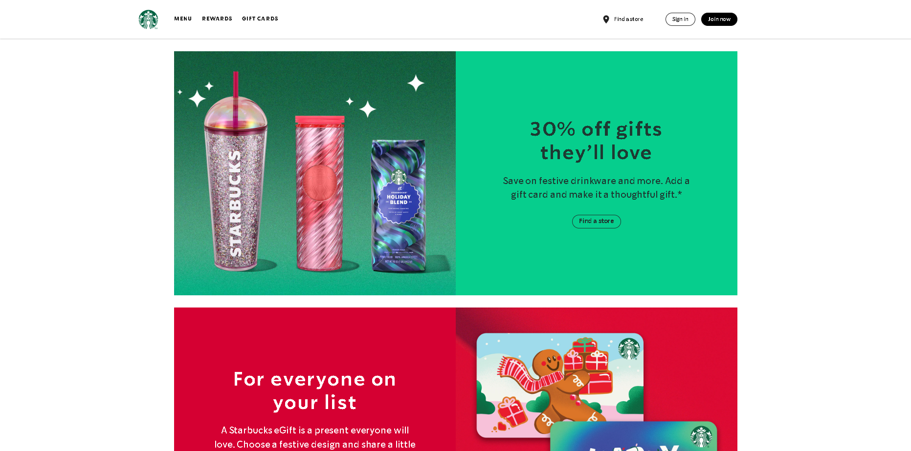
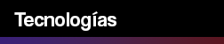

<h1>👨‍💻 Starbucks Clon</h1>

Lo que consistió este proyecto fue en realizar una copia de la página oficial de Starbucks Estados Unidos. El objetivo del ejercicio consistía en hacer el home y el menú de esta página y agregar gustos personales sobre cómo yo creía que se podía ver mejor la información.

Link de la página clon:
https://starbucks-clon-three.vercel.app/
<h2></h2>

